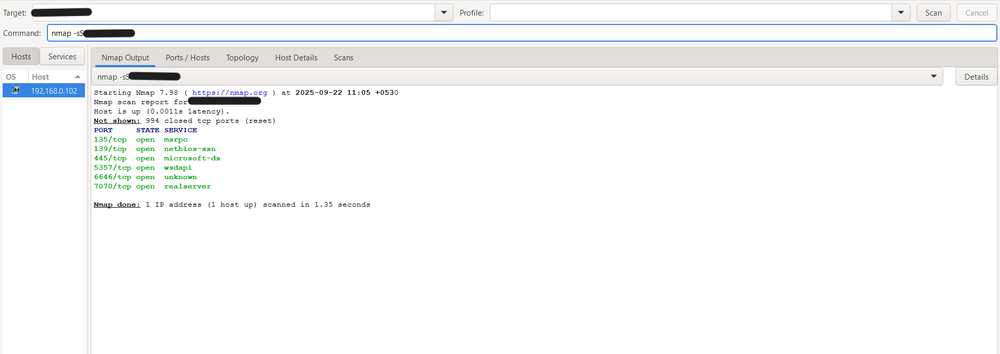

# Network Reconnaissance Report

## Introduction

The purpose of this task is to perform **basic network reconnaissance** using Nmap, a popular network scanning tool.  
Network reconnaissance is a key skill in cybersecurity that allows security professionals to identify **active devices, open ports, and running services** on a network. Understanding which ports are exposed helps in evaluating potential **security risks**.

In this report, we focus on scanning a **home/local network** to identify open ports and the services running on them. The task demonstrates the use of a **TCP SYN scan (-sS)** and optional packet analysis with **Wireshark**.

---

## Steps Performed / Methodology

1. **Install Nmap**  
   - On **Kali Linux**, Nmap comes pre-installed.  
   - For my case, I am using **Windows**, so I downloaded it from the official website: [https://nmap.org/download.html](https://nmap.org/download.html).  

2. **Check your IP address**  
   - On Windows, you can find your IP by opening **Command Prompt** and running:  
     ```
     ipconfig
     ```  
   - This provides your **IPv4 address**, which is needed to specify the target for scanning.  

3. **Run TCP SYN Scan**  
   - I used the **Nmap GUI** version on Windows. For Linux, Nmap CLI can be used.  
   - In the target field, I entered **my own IP address**, since scanning someone else’s device without permission is illegal.  
   - The TCP SYN scan (`-sS`) identifies **open ports** on the device in a stealthy manner.
     ```
     nmap -sS 192.168.0.102
     ```

4. **Capture Results**  
   - Nmap displayed the **IP address and open ports**, which I noted down for analysis.  
   - A screenshot of the scan output is presented below

**Screenshot:**


  
---


## Results & Analysis

The TCP SYN scan was performed on my own device (IP: `192.168.0.102`). The following open ports were detected:

| Port  | State | Service       |
|-------|-------|---------------|
| 135   | open  | msrpc         |
| 139   | open  | netbios-ssn   |
| 445   | open  | microsoft-ds  |
| 5357  | open  | wsdapi        |
| 7070  | open  | realserver    |
| 8090  | open  | opsmessaging  |

**Observations:**
- Ports **135, 139, 445** are related to **Windows file sharing and remote procedure calls**, which are commonly open on Windows devices.  
- Ports **5357, 7070, 8090** are associated with **network services like WSD, RealServer, and OpsMessaging**.  
- Open ports can pose a **security risk** if services are misconfigured or vulnerable to attacks. Proper firewall configuration and service management help mitigate these risks.  


---


# Wireshark Analysis

For this part, I used Wireshark to capture and analyze the network traffic while running an Nmap scan.

## Installation
Wireshark can be downloaded from its official website: https://www.wireshark.org/download.html
.
After downloading, I installed it on my Windows system.

## Selecting Capture Interface
Once Wireshark starts, you are presented with several options for capturing network traffic. Since I was running on a laptop connected to Wi-Fi, I selected the Wi-Fi interface (as shown in the screenshot).

**Screenshot:**


## Capturing Traffic
With Wireshark running, I started capturing traffic while executing an Nmap SYN scan on my own device (nmap -sS <my_ip>).
The capture displayed multiple TCP, TLS, and DNS packets, including the SYN packets generated by the scan.

**Screenshot:**


## Filtering Packets
To make the scan traffic easier to analyze, Wireshark supports display filters. For example, filtering for SYN packets from my device can be done using:
```
tcp.flags.syn == 1 && ip.addr == <your_ip>
```

This allows us to clearly see the scan attempts sent to different ports.

**Screenshot:**


## Observations

Normal traffic (TLS, DNS) was mixed with Nmap packets in raw capture.

Applying filters made it clear that Nmap was systematically sending SYN requests to multiple ports.

This aligns with how a SYN scan works: sending SYN packets without completing the full TCP handshake.


